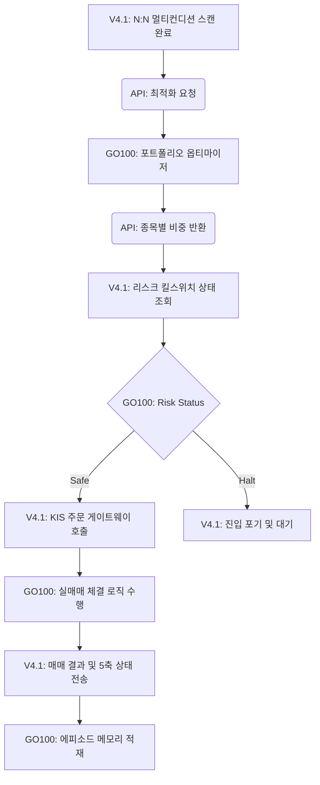

# KIS V4.1 × GO100 AI 백억이 통합 아키텍처 기획서 (v1.0)

> **문서 버전**: v1.0
> **작성일**: 2026-03-01
> **작성자**: AI PM (CEO 지시 기반)
> **대상 프로젝트**: KIS AutoTrade V4.1 & GO100

## 1. 개요 및 목적 (Overview & Purpose)

본 기획서는 룰 기반의 퀀트 트레이딩 엔진인 `KIS V4.1`에 고도화된 자율 AI 에이전트 생태계인 `GO100(백억이)`을 통합하여, **'N:N 멀티컨디션 매칭과 자본 복리(Compounding)를 관장하는 최고위 컨트롤 타워'**를 구축하는 것을 목적으로 한다.
두 시스템은 동일한 서버 내에 존재하지만, 서로의 코어 로직을 침범하지 않는 **느슨한 결합(Loose Coupling)**과 **REST API 브릿지(Bridge)** 방식으로 안전하게 연결된다.

## 2. 3대 연동 브릿지 구조 (3-Pillar Bridge Architecture)

### 2.1. 자본 컨트롤 브릿지 (Capital & Portfolio Bridge)
- **목적**: V4.1의 N:N 매칭 결과(당일 진입 후보 종목)를 기반으로 최적의 투자 비중을 산출.
- **GO100 인프라 활용**: Phase 6에서 구축된 `go100_portfolio_optimizer` (Markowitz, Risk Parity 등) 활용.
- **데이터 흐름**: V4.1 종목 리스트 송신 → GO100 켈리 베팅/옵티마이저 가동 → 종목별 % 비중 수신 후 주문.

### 2.2. 리스크/킬스위치 브릿지 (Risk & Kill-Switch Bridge)
- **목적**: 시스템 붕괴 및 시장 폭락(Layer 5) 방어를 위한 통합 리스크망 공유.
- **GO100 인프라 활용**: `go100_risk_events` 테이블 및 킬스위치 로직 공유.
- **데이터 흐름**: 매 분/매 주문 전 V4.1이 GO100 브릿지 API(`get_risk_status`)를 호출. 킬스위치 On 상태 시 V4.1 자동 셧다운.

### 2.3. 에피소드 메모리 브릿지 (Episodic Memory Bridge)
- **목적**: V4.1의 매매 결과, 5축 마스크 상태, DCS 점수를 AI가 학습할 수 있도록 영구 기억 장치에 적재.
- **GO100 인프라 활용**: Phase 4-1의 `go100_episodic_memory` 활용.
- **데이터 흐름**: 매매 종료 시 V4.1이 이벤트 맥락을 JSON 화하여 전송. (식별자: `agent_id="V4.1_DESK_AGENT"`).

## 3. 핵심 안전 수칙 (Safety Rules)

통합 과정에서 GO100의 기존 서비스를 보호하기 위해 다음 3대 원칙을 강제한다.
1. **코드 침범 금지**: V4.1에서 GO100의 파이썬 클래스/함수를 직접 `import` 하지 않는다. 오직 FastAPI 내부 라우터 호출(HTTP API)로만 소통한다.
2. **Read-Only / Append-Only**: V4.1 엔진은 GO100의 룰 테이블을 '읽기'만 하며, 메모리를 적재할 때는 기존 데이터를 수정하지 않고 '추가'만 한다.
3. **독립 페르소나 할당**: DB 적재 시 기존 GO100 봇과 섞이지 않도록 `V4.1_DESK_AGENT`라는 독립 네임스페이스를 사용한다.

## 4. 데이터 플로우 (Data Flow Sequence)

## 5. 단계별 개발 마일스톤 (Phased Roadmap)

- **Phase 1 (브릿지 인프라 구축)**: V4.1 내부 API 클라이언트 모듈(`go100_bridge_client.py`) 및 GO100 수신 전용 브릿지 라우터 개설.
- **Phase 2 (연동 테스트)**: 모의투자 환경에서 브릿지를 통한 리스크 상태 조회 및 메모리 적재 E2E 테스트.
- **Phase 3 (자본 최적화 적용)**: 실전 N:N 전략 도출 종목을 포트폴리오 옵티마이저에 태워 동적 베팅 비중(Kelly)을 적용한 최종 통합 구동.
